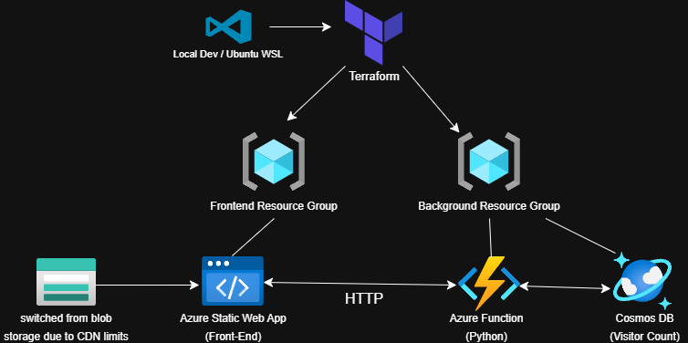

# Azure Resume

## Live Demo

- [https://aleemshaik.com/](#)

Welcome to my **Azure Resume Challenge** repository! This project is a full-stack cloud application that serves my interactive resume and implements a serverless visitor counter. Below is an overview of how everything is set up and the tools I used.

---

## Overview

1. **Frontend**: A static website hosted on **Azure Static Web Apps** (initially tested with Azure Blob Storage, but switched due to CDN limitations on a student subscription). Built using **HTML**, **CSS**, and **JavaScript**.

2. **Backend**: A **Python Azure Function** that increments a view count in **Azure Cosmos DB**. Triggered via HTTP each time someone visits the site.

3. **Infrastructure as Code**: Everything is provisioned with **Terraform**—resource groups, function app, Cosmos DB, and static web app.

4. **CI/CD**: A GitHub Actions workflow automatically builds and deploys the front-end on each push to the main branch.

---

## Tools & Technologies

- **Azure** (Static Web Apps, Functions, Cosmos DB, Resource Groups)  
- **Terraform** for Infrastructure as Code  
- **GitHub & GitHub Actions** for source control and front-end CI/CD  
- **Python** for the serverless function (v3.10)  
- **HTML/CSS/JS** for the resume site
- **Bash & Linux**: WSL Ubuntu command-line environment used for local development, Terraform deployment, and general scripting.

---

## Challenges Faced

- **Version Mismatch**: Originally tried a full C#/.NET backend but ran into isolation and version issues, so I switched to Python for a smoother setup.  
- **Networking**: Ensured a simple CNAME record approach for custom domain mapping after I encountered difficulties mapping an apex domain.
- **Terraform State**: Had to manage large files and `.gitignore` complexities to avoid committing provider binaries.

---

## Future Additions

- **Unit Tests**: Add tests for the Python Azure Function.  
- **Backend CI/CD**: Implement GitHub Actions to automate deployments for the function code.  
- **Analytics**: Extend visitor counter to track more metrics (e.g., unique visits).  
- **Security**: Store secrets (function keys, etc.) in Key Vault or environment variables.

---